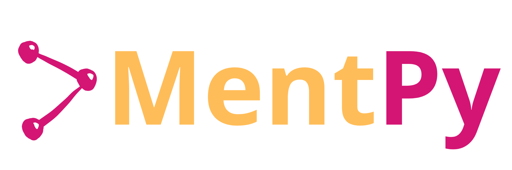

<p align="center">
  
</p>

<div align=center>
  <a href="https://pypi.org/project/mentpy"></a>
  <!-- <a href="https://pypi.org/project/mentpy"></a> -->
  <a href="https://pypi.org/project/mentpy"></a>
  <a href='https://mentpy.readthedocs.io/en/latest/?badge=latest'>
    
</a>
  <!-- <a href="https://pypistats.org/packages/mentpy"></a>
  <a href="https://pypi.org/project/mentpy"></a> -->
  <a href="https://twitter.com/mentpy"></a>
  <!-- <a href="https://github.com/bestquark/mentpy/actions/workflows/docs.yaml"></a>
  <a href="https://github.com/bestquark/mentpy/actions/workflows/lint.yaml"></a>
  <a href="https://github.com/bestquark/mentpy/actions/workflows/build.yaml"></a>
  <a href="https://github.com/bestquark/mentpy/actions/workflows/test.yaml"></a>
  <a href="https://codecov.io/gh/bestquark/mentpy"></a> -->
</div>

The `MentPy` library is an open-source software for simulations of 
measurement-based quantum computing circuits. Currently, this package is in its alpha version and many features are still in development.

## Installation

The `MentPy` library can be installed using `pip` with

```bash
pip install mentpy
```

or directly from the source code for the latest version with

```bash
pip install git+https://github.com/BestQuark/mentpy.git
```

## Usage
To simulate a measurement pattern, you can use the `mp.PatternSimulator`.
```python
import mentpy as mp

st = mp.templates.grid_cluster(2,4)
ps = mp.PatternSimulator(st)
output = ps(np.random.rand(len(st.outputc)))
```

For visualization of circuits, you can use the `mp.draw(st)` function


## Documentation

The documentation for `MentPy` can be found <a href="https://mentpy.readthedocs.io/en/latest/" target="_blank">here</a>.

## Contributing

We welcome contributions to `MentPy`! Please see our [contributing guidelines](./CONTRIBUTING.md) for more information.

## License

`MentPy` is licensed under the [GNU General Public License v3.0](./LICENSE).

